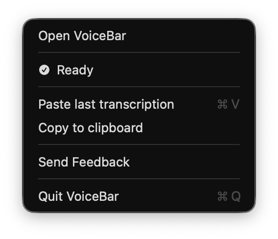
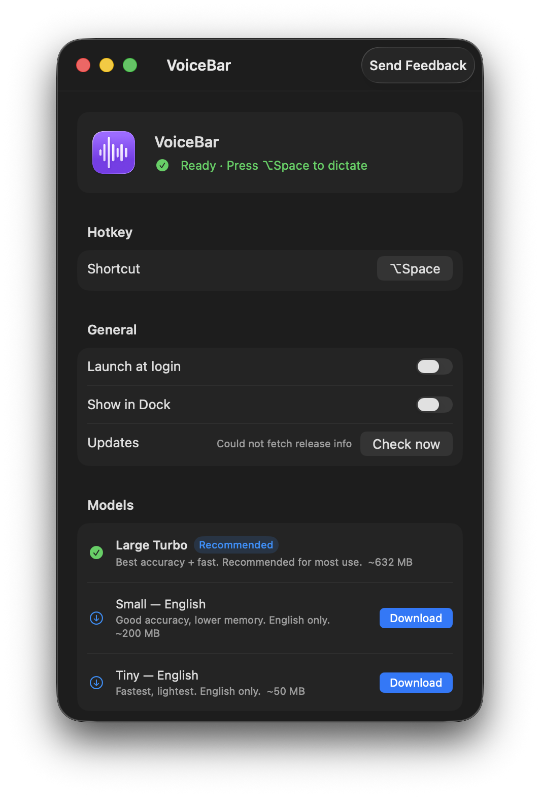

# VoiceBar

**Dictate anywhere on your Mac. Text appears at your cursor.**

Hold a hotkey → speak → done. No window to switch to. No copy-paste. Just speak and your words land exactly where you need them.

<p align="center">
  
  &nbsp;&nbsp;&nbsp;
  
</p>

---

## Why VoiceBar

Most dictation tools make you dictate into their own box, then copy the result. VoiceBar skips that entirely — it inserts text directly at your cursor, in whatever app you're already using. Write emails, fill forms, take notes, code comments — without ever leaving the window you're in.

It runs completely on your Mac. Nothing is sent to a server. No subscription, no account, no internet required after the first model download.

---

## Features

- **Hotkey to anywhere** — press to start, press again to stop. Text appears in the focused field.
- **Fully on-device** — powered by [WhisperKit](https://github.com/argmaxinc/WhisperKit) and Apple's Neural Engine. Your words never leave your Mac.
- **Deferred paste** — finish dictating, then click into any window. VoiceBar pastes automatically.
- **Live preview** — see words appear in the menu bar as you speak.
- **Escape to cancel** — changed your mind mid-sentence? Just press Escape.
- **Customisable hotkey** — set any key combination you like.
- **Multiple models** — choose between speed and accuracy. Large Turbo recommended for most use.
- **Minimal footprint** — lives in the menu bar. No Dock icon by default. Launches in under a second once the model is loaded.

---

## Install

1. Download **VoiceBar.dmg** from the [latest release](https://github.com/anau219/VoiceBar/releases/latest)
2. Open the DMG and drag VoiceBar to your Applications folder
3. Right-click → **Open** on first launch *(required — app is not yet notarized)*
4. Grant **Accessibility** access when prompted — VoiceBar needs this to type at your cursor
5. The Whisper model (~650 MB) downloads automatically in the background on first launch

That's it. VoiceBar lives in your menu bar, ready when you are.

---

## How it works

```
Hold hotkey  →  speak  →  release hotkey  →  text appears at cursor
```

VoiceBar records your voice locally, runs it through Whisper on your Neural Engine, and injects the result directly into whichever text field is focused — no clipboard, no switching windows.

If the cursor focus is unclear when you finish speaking, just click into the right field within 3 seconds and VoiceBar pastes automatically.

---

## Models

| Model | Size | Best for |
|-------|------|----------|
| **Large Turbo** *(recommended)* | ~650 MB | Best accuracy, fast. Works great for most use. |
| Small — English | ~200 MB | Lower memory, English only. |
| Tiny — English | ~50 MB | Fastest, lightest. English only. |

Models are downloaded once and stored locally. You can switch or delete them anytime from the settings window.

---

## Requirements

- macOS 14 (Sonoma) or later
- Apple Silicon or Intel Mac
- Microphone access
- ~650 MB disk space for the default model

---

## Privacy

VoiceBar processes everything on your device. No audio, text, or usage data is ever sent anywhere. The only network request is the one-time model download from Hugging Face.

---

## Build from source

```bash
git clone https://github.com/anau219/VoiceBar.git
cd VoiceBar
open VoiceBar.xcodeproj
```

Requires Xcode 15+. Dependencies (WhisperKit, HotKey, LaunchAtLogin) are resolved automatically via Swift Package Manager.

---

## Feedback

Found a bug or have an idea? Use the **Send Feedback** option in the app (menu bar icon → Send Feedback) or [open an issue](https://github.com/anau219/VoiceBar/issues).

---

*Built with [WhisperKit](https://github.com/argmaxinc/WhisperKit) by Argmax.*
